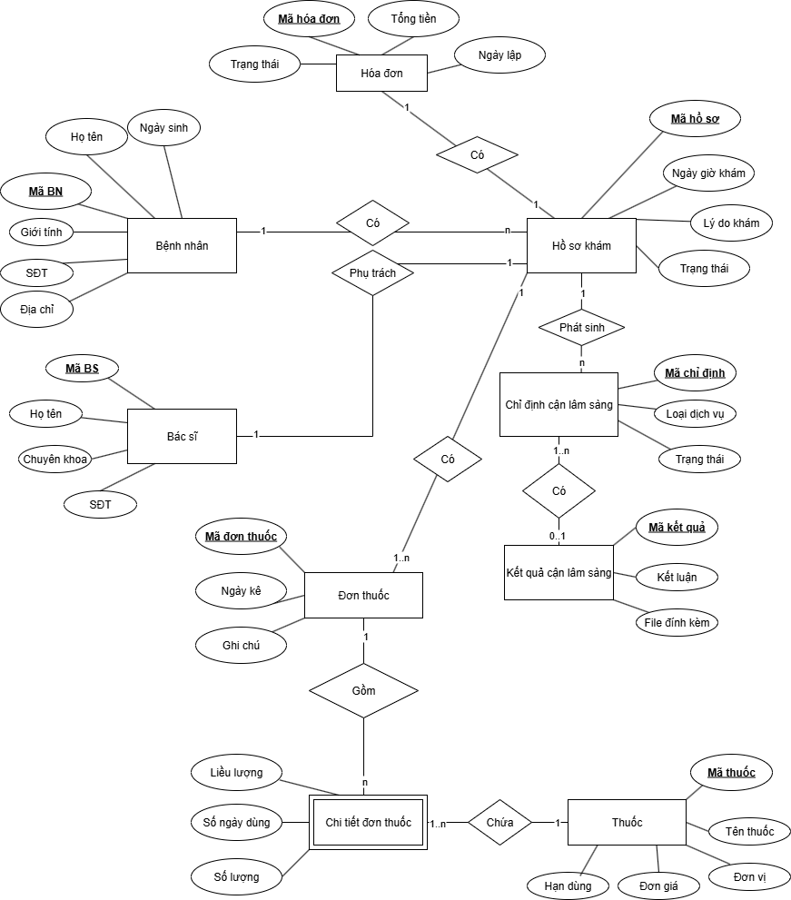
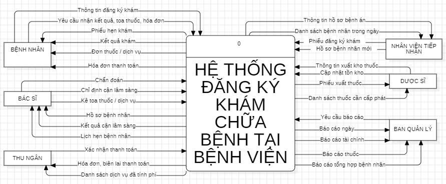
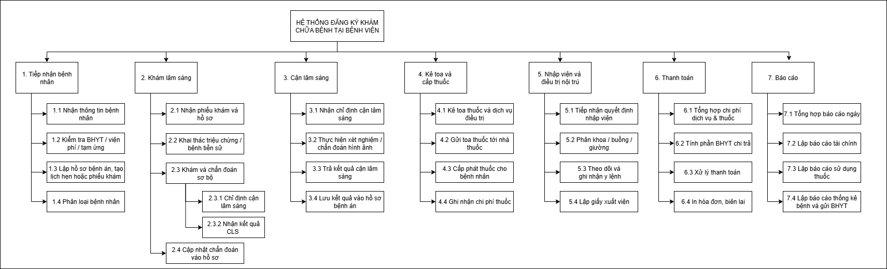
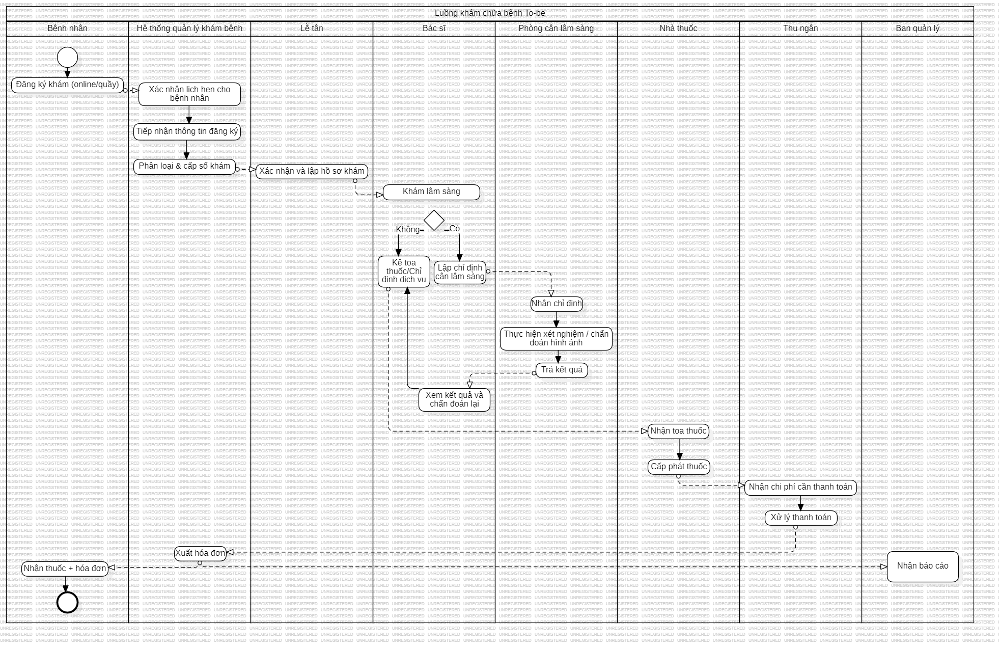

# HOSPITAL REGISTRATION SYSTEM

> **Goal:** Design a hospital appointment registration system to digitize and streamline medical processes.  

---

## Overview  
This project builds a hospital appointment registration system that supports both online (website/app) and offline (reception desk) booking. It covers patient records, appointment scheduling, prescriptions, hospital fees, and admission/discharge processes.  

---

## Key Features  
- Online and offline appointment booking.  
- Patient record management: personal info, health insurance (BHYT), medical history.  
- Doctor functionalities: diagnosis entry, prescription, medical service requests.  
- Hospital fee and billing management.  
- Patient status update: consultation, hospitalization, discharge.  

---

## Tools & Methods  
- System analysis: Function Decomposition Diagram (BPC), Data Flow Diagram (DFD), Entity Relationship Diagram (ERD), Use Case, BPMN.  
- Form design: registration form, examination form, invoices, admission/discharge papers.  
- Prototype interfaces for hospital management workflows.  

---
---

## Illustrations

### ERD

### Use Case

### DFD – Context

### DFD – Level 0

### Function Decomposition (BPC)

### BPMN – AS-IS

### BPMN – TO-BE

---

## Business Value  
- Digitizes hospital operations, reducing paperwork.  
- Enhances transparency in medical fee management.  
- Improves patient experience with digital scheduling.  
- Highly applicable in healthcare projects; aligns with Business Analyst deliverables.  

---
